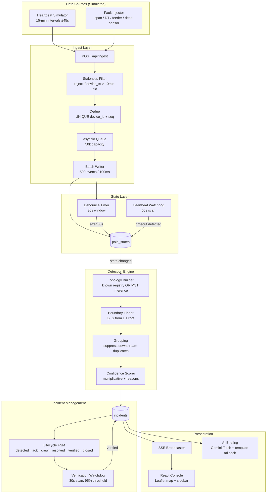
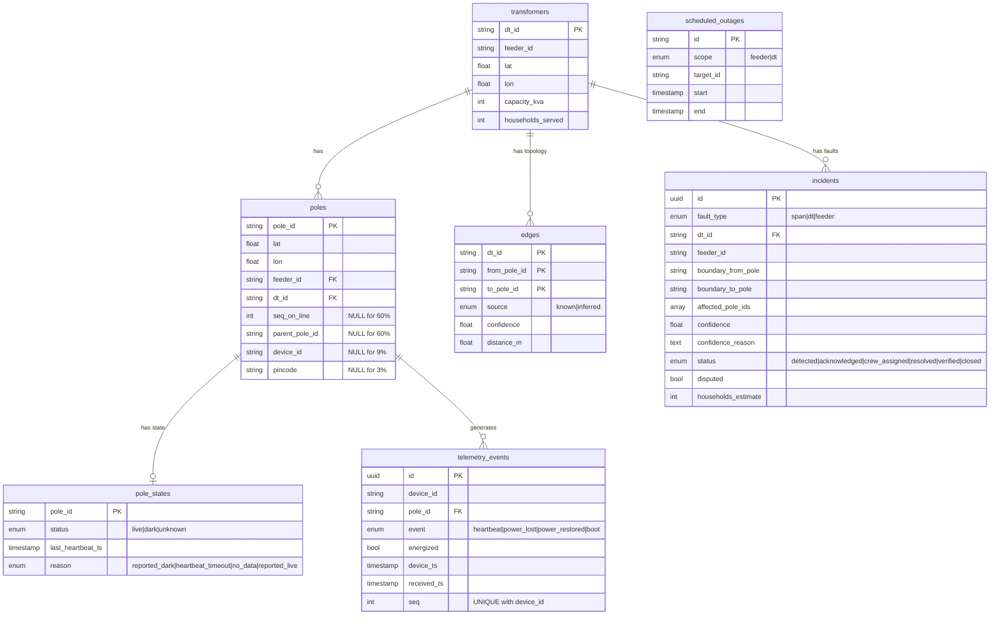

# Architecture — GridWatch

## System Overview

## Data Flow — Event to Ticket (< 120s budget)

| Step | Component | Time Budget | Notes |
|------|-----------|-------------|-------|
| 1 | Ingest + queue | ~5ms | Enqueue returns immediately |
| 2 | Batch write | ~50ms | Batch of up to 500 events |
| 3 | Debounce wait | 30,000ms | Configurable. Prevents flicker. |
| 4 | Pole state update | ~5ms | Single row upsert |
| 5 | Topology build | ~100ms | MST on ~80 poles (O(n² log n)) |
| 6 | Boundary BFS | ~10ms | Linear in tree size |
| 7 | Grouping + dedup | ~1ms | Filter pass |
| 8 | Confidence scoring | ~1ms | 5 multiplicative factors |
| 9 | Incident upsert | ~10ms | With overlap check |
| 10 | SSE broadcast | ~1ms | Non-blocking fanout |
| **Total** | | **~30.2s** | Well under 120s budget |

## Database Schema

## Topology Inference — The Central Algorithm

### Known Topology (40% of DTs)
Registry provides `seq_on_line` and `parent_pole_id` → direct tree construction.
Confidence: **1.0** for all edges.

### Inferred Topology (60% of DTs)
Only GPS coordinates available. Algorithm:

1. **Candidate edge set**: All pole pairs within 150m + all DT-to-pole pairs
2. **MST**: Kruskal's algorithm (union-find, O(E log E))
3. **Orient**: BFS from DT → assign parent pointers
4. **Confidence**: Per-edge score = `clamp(local_median_spacing / edge_length, 0.1, 1.0)`

**Why MST?** Distribution poles physically form a tree (no loops on LT side).
A geographic MST rooted at the DT is the minimum-assumption estimator.

### Known Failure Modes
- Dense parallel lines → MST may cross-connect
- T-junctions → may pick wrong electrical connection
- Very long spurs → low confidence but correctly identified

## Fault Detection — Boundary Finding

The key insight: **a fault is on an EDGE, but sensors report on NODES.**

BFS from DT root. At each parent→child edge:
- If parent is **live** and child is **dark** → **BOUNDARY FOUND**
- Collect the entire dark subtree below → one `FaultCandidate`

### Critical Exception: Dead Sensor
A single dark pole with **live children** is physically impossible as a line fault.
The wire can't be broken AND carry power past the break. This means the **sensor lied**.
→ Skip, do NOT create a ticket.

### No-Device Gap Widening
If a boundary pole has no device, we can't observe it directly.
→ Widen the boundary to the nearest observed ancestor/descendant pair.
→ Add a confidence penalty for the uncertainty.
